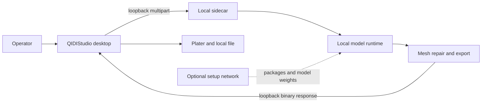

# Ecosystem Map

## Product vision

ThoxForge is the local photo-to-print bridge for THOX hardware prototyping. It
combines the QIDIStudio desktop slicer with a private AI sidecar so campaign and
engineering teams can turn device photos into editable mesh candidates without
uploading those photos to a hosted inference API.

## Current modules

- QIDIStudio desktop UI and plater
- `AIPhotoTo3DDialog` workflow
- libcurl loopback client
- Flask sidecar on `127.0.0.1:7861`
- TRELLIS and TripoSR adapters
- background removal, mesh repair, validation, and export

## Personas and campaign value

- Hardware designer: creates enclosure and fit-check mesh candidates.
- Kickstarter campaign producer: creates prototype visuals and printable mockups.
- Manufacturing engineer: repairs and scales meshes before slicing.
- Security reviewer: verifies photos stay on the operator-controlled host.

Generated geometry is an engineering aid, not dimensional proof. Physical fit,
tolerances, material behavior, printer profiles, and print safety require human
review.

## Local-first and security boundaries

- Runtime API binds to loopback and rejects non-loopback Host/peer values by
  default.
- ThoxForge adds no telemetry or hosted inference API.
- Model/package acquisition can access public repositories during setup.
- QIDIStudio upstream printer and support features may contain separate network
  paths; they are outside the AI sidecar trust claim.
- Remote sidecar mode is explicit, unauthenticated, and not approved for
  sensitive workflows.

## Future architecture

- Offline dependency/model bundle with signed manifest and SBOM.
- Managed sidecar lifecycle with readiness and recovery states.
- Encrypted workspace retention policy for input and generated assets.
- Signed/notarized desktop packages with reproducible release evidence.
- Human approval record for generated-to-print transitions.
